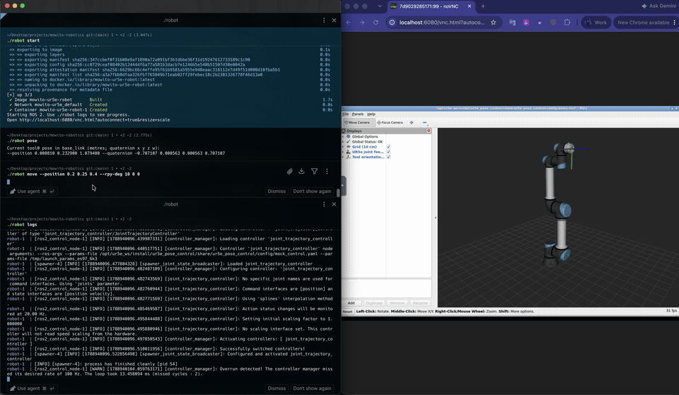
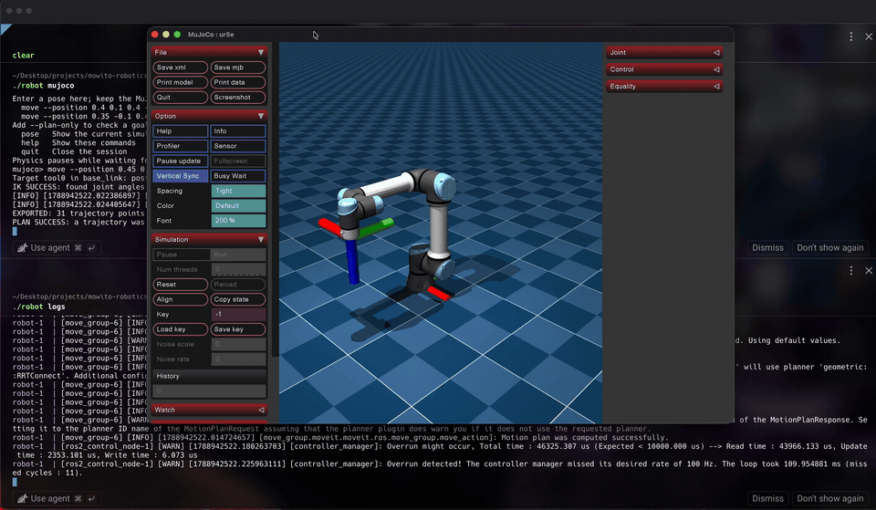

# UR5e pose control

Enter a tool position and orientation in the terminal. A small Python ROS 2 node
asks MoveIt 2 to plan and execute the motion. RViz shows the UR5e moving, and the
node checks the final reported pose.

## Demo videos

Animated excerpts of both demos are shown below. Click a preview or its link to
open the full recording.

### ROS 2 + RViz

Pose commands with the UR5e mock driver and MoveIt.

[](assets/ros2_rviz_demo.mp4)

[Watch the full RViz recording](assets/ros2_rviz_demo.mp4)

### ROS 2 + MuJoCo

MoveIt planning with native physics simulation.

[](assets/ros2_mujoco_demo.mp4)

[Watch the full MuJoCo recording](assets/ros2_mujoco_demo.mp4)

## Project scope

This implements **Stage 1** of the assignment: ROS 2, the official UR5e driver,
Python terminal input, and RViz. The supplied launch always uses **mock hardware**.
The optional Stage 2, **NVIDIA Isaac Sim**, has not been explored yet because we
do not currently have access to an NVIDIA GPU. Instead, we implemented a
**native macOS MuJoCo physics demo**, reusing the same pose input and MoveIt
planner to execute exported plans using simulated motors. This provides an
additional physics demonstration alongside ROS/RViz; the Isaac Sim bonus remains
unimplemented. See the [MuJoCo setup and demo guide](simulation/README.md).

## Installation and setup

The verified setup is **Apple Silicon macOS**, using an ARM64 Linux container
for ROS/RViz and native Python for the optional MuJoCo demo. The instructions
below start from a fresh machine and clone; no personal folder paths are needed.

You need Git, Python 3, Docker Engine, the Docker CLI, Compose, Buildx, and a web
browser. On macOS, Colima supplies Docker Engine inside a Linux VM. Allow room
for a 40 GiB VM disk; the example allocates 4 CPUs and 6 GiB RAM to the VM. A host
with 16 GiB RAM is recommended when running both demos. Internet access is needed
for the initial package/image downloads, and your GitHub account needs access to
this private repository.

| Component | What it does |
| --- | --- |
| Colima | Starts a Linux VM with Docker Engine inside it. |
| Docker CLI and Compose | Build and manage the project's container from the Mac terminal. |
| ROS 2 and MoveIt | Run the driver, solve inverse kinematics, and plan and execute motion. |
| RViz | Displays the robot using its reported joint states. |
| noVNC | Streams the Linux RViz window to your Mac browser. |

**Docker Desktop's engine and GUI are not needed for this setup.** Colima provides
the engine that the Docker CLI connects to. Colima does not perform the robot
simulation or visualization; those programs run inside the container.

### 1. Install the host tools

**Apple Silicon macOS**

If Homebrew is missing, install it using the command from
[Homebrew's installation page](https://brew.sh/):

```bash
/bin/bash -c "$(curl -fsSL https://raw.githubusercontent.com/Homebrew/install/HEAD/install.sh)"
```

Complete the installer's prompts, including any Command Line Tools installation
and shell-profile instructions. Then install the project prerequisites:

```bash
eval "$(/opt/homebrew/bin/brew shellenv)"
brew install git python@3.12 colima docker docker-compose docker-buildx
export PATH="$(brew --prefix python@3.12)/libexec/bin:$PATH"

# Make the Homebrew Compose and Buildx plugins discoverable by Docker.
mkdir -p "$HOME/.docker/cli-plugins"
ln -sfn "$(brew --prefix docker-compose)/bin/docker-compose" "$HOME/.docker/cli-plugins/docker-compose"
ln -sfn "$(brew --prefix docker-buildx)/bin/docker-buildx" "$HOME/.docker/cli-plugins/docker-buildx"

colima start --cpus 4 --memory 6 --disk 40 --vm-type vz
docker context use colima
```

These commands use the CLI-only Colima setup. If Docker Engine and its plugins
are already installed and working, reuse them and skip the installation steps.
For a Homebrew-only installation, the plugin links above also let the project's
isolated Docker CLI configuration find Compose and Buildx.
Package details: [Compose](https://formulae.brew.sh/formula/docker-compose) and
[Buildx](https://formulae.brew.sh/formula/docker-buildx).

**Ubuntu Linux: alternative ROS/RViz setup**

Install Docker Engine, CLI, Buildx, and the Compose plugin using
[Docker's Ubuntu installation guide](https://docs.docker.com/engine/install/ubuntu/).
On Linux, Docker Engine runs directly on the host; skip the Colima commands.
Install the remaining host tools:

```bash
sudo apt-get update
sudo apt-get install -y git python3
```

Configure Docker access for your normal user as described in
[Docker's Linux post-installation guide](https://docs.docker.com/engine/install/linux-postinstall/),
then log out and back in. The `./robot` wrapper expects `docker info` to work
without `sudo`. Docker group membership grants root-level access to the host.
Follow the architecture step below before building. This Linux setup has not
been validated by this project; the native MuJoCo wrapper is currently macOS-only.

**Check the tools before continuing**

```bash
git --version
python3 --version
docker --version
docker compose version
docker buildx version
docker info
```

`docker info` must show a running server as well as the client. You do not need
to install ROS, MoveIt, the UR driver, or RViz on the host.

### 2. Clone the repository


```bash
git clone https://github.com/Thehunk1206/ur5e-ros2-pose-control.git
cd ur5e-ros2-pose-control
```


The robot model and its meshes are included in the clone; no separate model
download is required. Run all remaining `./robot` commands from the cloned
directory, which contains `robot`, `Dockerfile`, and `compose.yaml`.

### 3. Check the container architecture

```bash
uname -m
```

[compose.yaml](compose.yaml) currently selects `platform: linux/arm64`.
Keep this setting for Apple Silicon (`arm64`) or ARM64 Linux (`aarch64`).
On an Intel/AMD Linux host (`x86_64`), change that line to
`platform: linux/amd64` before building. The AMD64 build is not verified here.
Intel macOS and Windows do not have a verified setup in this repository.

### 4. Build and start ROS/RViz: Terminal 1

```bash
cd ~/projects/ur5e-ros2-pose-control

./robot start
```

`./robot start` builds the Docker image and starts the container. It runs Compose
with `up --build -d`. To build the image separately before starting, you can use:

```bash
docker compose build
./robot start
```

The Dockerfile installs ROS 2 Jazzy, the UR driver, MoveIt, RViz, `colcon`, and
the display tools. Container startup then builds this ROS package from `src/`
and launches the driver, MoveIt, and RViz. The first build takes several minutes;
later builds reuse Docker's cache. You do not need to run `colcon` on the host.

Open [RViz in your browser](http://localhost:6080/vnc.html?autoconnect=true&resize=scale).
On macOS, you can also use:

```bash
open 'http://localhost:6080/vnc.html?autoconnect=true&resize=scale'
```

On Linux, paste the same URL into a browser on the Docker host. Wait until the
robot appears. Its red, green, and blue tool
axes represent X, Y, and Z. If the page opens before the display is ready, reload it.

Show the startup and controller logs in Terminal 1:

```bash
./robot logs
```

This command keeps following the logs. Use a second terminal for motion commands.
Pressing Ctrl-C **while following logs** only stops the log viewer; the container
continues running.

## Usage: move the robot in RViz

Open another Terminal window and keep RViz visible beside it. Run each command
separately, waiting for it to finish before starting the next one.

```bash
cd ~/projects/ur5e-ros2-pose-control
```

### 1. Read the current tool pose

```bash
./robot pose
```

This prints the current `tool0` pose relative to `base_link`, including position
and quaternion arguments that you can copy into a move command. If it reports
that no fresh transform is available during startup, check Terminal 1's logs and
try again once the driver has started.

### 2. Preview a plan without moving

```bash
./robot move --position 0.4 0.1 0.4 --rpy-deg 180 0 0 --plan-only
```

Expected result: `IK SUCCESS`, then `PLAN SUCCESS`. The robot stays still.
Plan-only does not save a trajectory; a later move command computes a new plan.

### 3. Execute the first pose

```bash
./robot move --position 0.4 0.1 0.4 --rpy-deg 180 0 0
```

Watch the robot move in RViz. The terminal reports the final position and angular
errors, followed by `SUCCESS` when both are within tolerance. Exact errors and
the sampled path can vary between runs.

### 4. Change both position and orientation

```bash
./robot move --position 0.35 -0.1 0.45 --rpy-deg 180 0 30
```

Wait for `SUCCESS`, then show the resulting pose:

```bash
./robot pose
```

### 5. Demonstrate an unreachable input

```bash
./robot move --position 10 10 10 --rpy-deg 0 0 0
```

This deliberately unreachable pose should report `NO_IK_SOLUTION` and exit with
code 1 without moving the robot. It demonstrates error handling.

Pressing Ctrl-C **during a move command** requests cancellation of that motion
and waits for the action's final state. The client exits with code 130.

## Optional: native MuJoCo on Apple Silicon macOS

With ROS/MoveIt running, install the native dependencies once and start a physics
demo. The setup command prefers the `python3.12` installed above and creates the
ignored `.venv-mujoco/` environment using [simulation/requirements.txt](simulation/requirements.txt).

```bash
cd ~/projects/ur5e-ros2-pose-control
./robot mujoco-setup

# Open a persistent native window and terminal command prompt.
./robot mujoco
```

At the `mujoco>` prompt in the same terminal, enter these commands one at a time:

```text
move --position 0.4 0.1 0.4 --rpy-deg 180 0 0
move --position 0.35 -0.1 0.45 --rpy-deg 180 0 30
pose
quit
```

The window stays open between moves. Each plan starts from the current simulated
joints, so the arm continues from its last pose. Add `--plan-only` to a pose to
check it without motion. Physics pauses during input and planning. Type `quit`,
press Ctrl-C, or close the window to end the session.

You can still pass an initial pose to `./robot mujoco`. Add `--headless` for a
single run without a window, or `--close-on-finish` for a window that closes after
that motion. MuJoCo does not send joint feedback to RViz; the views are separate.
See the [MuJoCo guide](simulation/README.md) for saved-plan replay and details.

## Input reference

| Argument | Meaning |
| --- | --- |
| `--position X Y Z` | Position in **metres**, relative to `base_link`. |
| `--rpy-deg ROLL PITCH YAW` | Orientation in **degrees**, using fixed-axis X/Y/Z rotations. |
| `--quaternion QX QY QZ QW` | Alternative orientation input; order is **x, y, z, w**. |
| `--plan-only` | Calculate a plan without requesting execution. |

Supply a position and exactly one orientation format. For roll/pitch/yaw, the
rotation matrix is `Rz(yaw) Ry(pitch) Rx(roll)`. Quaternion input is normalized;
zero-length quaternions, NaN, and infinity are rejected. The target is the bare
arm's `tool0` frame; no gripper offset is modelled.

The first demo pose can also be expressed as:

```bash
./robot move --position 0.4 0.1 0.4 --quaternion 1 0 0 0
```

## Command reference

Run these commands from the project directory:

| Command | Purpose |
| --- | --- |
| `./robot start` | Build the image if necessary and start the container. |
| `./robot pose` | Print the current tool pose. |
| `./robot move ...` | Plan and execute a target pose. |
| `./robot mujoco-setup` | Install optional native MuJoCo dependencies on macOS. |
| `./robot mujoco [pose arguments]` | Open MuJoCo and accept successive poses at its terminal prompt. |
| `./robot export FILE ...` | Save a MoveIt plan as JSON without executing it. |
| `./robot logs` | Follow startup, planning, and controller logs. |
| `./robot shell` | Open a container shell with ROS and this package already sourced. |
| `./robot stop` | Stop and remove this project's container; keep the image and source files. |
| `./robot help` | Print the available commands. |
| `colima status` | On macOS, check the Linux VM and its Docker runtime. |
| `docker ps` | List running containers in the selected Docker context. |

Inside `./robot shell`, the underlying ROS command is:

```bash
ros2 run ur5e_pose_control move_to_pose --position 0.4 0.1 0.4 --rpy-deg 180 0 0
```

Use `exit` to leave that shell. The `./robot` wrapper is a convenience for running
the same ROS commands from the host terminal.

## Stop or restart

Stop the project from the host terminal:

```bash
./robot stop
```

On macOS, optionally stop the Colima VM too:

```bash
colima stop
```

`colima stop` also stops the VM used by any other containers on this Colima
instance. You can leave Colima running if you still need those containers.

To reset the robot to its startup pose while leaving Docker Engine running:

```bash
./robot stop
./robot start
```

Reload the RViz browser tab after a restart. On macOS, if Colima was stopped,
run `colima start --cpus 4 --memory 6 --disk 40 --vm-type vz` and
`docker context use colima` before `./robot start`.

Python source is mounted from this directory, so normal Python edits take effect
on the next command. The package is built each time the container starts. After
changing launch files, configuration, package metadata, or dependencies, stop and
start the container with the two commands above. Running `./robot start` alone
does not restart an already-running, unchanged container.

The wrapper uses an ignored `.docker-cli/` directory for public image downloads
and Compose plugin discovery. It leaves the Mac's normal Docker credentials and
credential-helper settings untouched. The source mount is read-only inside the
container; generated ROS build files live inside the container.

## Read the code in this order

| File | Responsibility |
| --- | --- |
| [move_to_pose.py](src/ur5e_pose_control/ur5e_pose_control/move_to_pose.py) | The main assignment: solve IK, create a motion goal, wait, and check the result. |
| [pose_math.py](src/ur5e_pose_control/ur5e_pose_control/pose_math.py) | Validate inputs, convert degrees to a quaternion, choose equivalent joint angles, and measure pose error. |
| [demo.launch.py](src/ur5e_pose_control/launch/demo.launch.py) | Start UR's driver, MoveIt, and RViz using the supplied UR model/configuration. |
| [robot](robot), [Dockerfile](Dockerfile), [docker/](docker/) | Mac/Linux setup and convenience commands; these contain no motion-planning logic. |

The robot-specific names are constants: `base_link`, `tool0`, `ur_manipulator`.
One process handles one command. There are no custom messages, custom planners,
or third-party Python wrappers around MoveIt.

## What happens when you give a goal

1. **Validate.** Read position and orientation. Reject missing or non-finite
   values. Convert roll/pitch/yaw degrees into a normalized quaternion.
2. **Solve inverse kinematics (IK).** Send the complete pose to MoveIt's
   `/compute_ik` service. Its KDL solver uses the current robot state as a starting
   guess and finds joint angles matching both position and orientation. The
   destination must also pass the planning scene's collision check.
3. **Plan and execute.** `make_goal()` chooses the equivalent target angle nearest
   each current joint, within the robot model's position and safety limits. For
   example, 221 degrees and -139 degrees give the same tool pose; one can require
   much less motion from the current state. `planning_state()` reads the current
   joints and URDF limits from MoveIt, so those limits are not hardcoded. The node
   puts the chosen angles into a `MoveGroup` goal and sends it to `/move_action`.
   MoveIt's OMPL pipeline finds a path from
   the current state to that joint configuration, checking collisions along the
   path. It creates a timed joint trajectory
   and sends it to `joint_trajectory_controller`.
4. **Observe and verify.** Mock hardware mirrors controller commands into joint
   feedback. `robot_state_publisher` computes link transforms from that feedback;
   RViz displays them. After execution completes, our node reads a fresh
   `base_link -> tool0` transform and checks the final pose.

```text
Python pose -> MoveIt IK -> MoveIt planner -> controller -> mock hardware
                    ^                                         |
                    +------------ joint feedback -------------+
                                          |
                               robot_state_publisher -> RViz
                                          |
                                  final pose check
```

`rclpy.spin_until_future_complete()` processes incoming ROS callbacks while a
request is pending. We use a ROS action because motion takes time, has feedback,
and can be cancelled. Sending the request is not treated as successful execution.

Position error is Euclidean distance. Orientation error is the shortest rotation
angle between the goal and feedback quaternions. `q` and `-q` mean the same
orientation. The final feedback must be within **5 mm and 0.01 radians** (about
0.57 degrees) of the requested pose. These are verification thresholds. IK targets
the exact pose, and the planner's joint goal tolerance is 0.0001 radians per joint.

Planning has a 10-second budget; the client waits at most 90 seconds for the
combined planning/execution result. Velocity and acceleration scaling are both
0.1. The mock controller runs at 100 Hz to suit a laptop VM. Ctrl-C or a client
timeout requests cancellation; the client reports if it
cannot confirm the action's final state. Cancellation is not a physical emergency stop.
The IK request has a two-second search budget. IK is a service call because it
returns a short calculation result; motion uses an action because it runs over time.

Exit codes: `0` success, `1` ROS/planning/execution/verification failure, `2` invalid
arguments, `130` interrupted by Ctrl-C.

## Verified environment

ROS 2 Jazzy, UR driver/config 3.8.0, MoveIt core 2.12.4, and RViz 14.1.22,
on a Colima VM with 4 CPUs and 6 GB RAM.


## Limitations

- A pose can be unreachable even when its position looks nearby: orientation,
  joint limits, self-collision, and the starting configuration also matter.
- A planning timeout means no solution was found in that budget. It does not
  prove no valid path exists.
- A pose can have multiple joint solutions. This minimal implementation selects
  one IK solution and plans to it. If that path fails, it does not search all other
  IK branches. The sampled solution and path can vary between runs.
- Choosing the nearest legal equivalent angle reduces each joint's requested
  rotation. It does not guarantee the shortest collision-free trajectory or
  choose the best of all possible IK branches.
- Run one goal command at a time. Concurrent requests can preempt one another.
- The pose applies at the destination. It does not enforce a straight tool
  path or a constant tool orientation throughout the motion.
- Only the arm is modelled. RViz's floor grid is not a collision object. A table,
  gripper, workpiece, and other obstacles must be added to the planning scene.
- Mock hardware is an ideal position simulation. It does not model gravity,
  payload, contacts, tracking error, or protective stops. Reported success is a
  simulation result, not proof of real-world accuracy or safety.
- A real arm needs the correct calibration, TCP/tool geometry, payload, controller
  configuration, External Control program, networking, workspace model, and
  validated speed/stop behaviour. The provided launch does not connect to one.

## References

- [Official UR ROS 2 driver](https://github.com/UniversalRobots/Universal_Robots_ROS2_Driver)
- [MoveIt architecture](https://moveit.picknik.ai/main/doc/concepts/move_group.html)
- [MoveGroup action definition](https://github.com/moveit/moveit_msgs/blob/ros2/action/MoveGroup.action)
- [Colima](https://github.com/abiosoft/colima)
